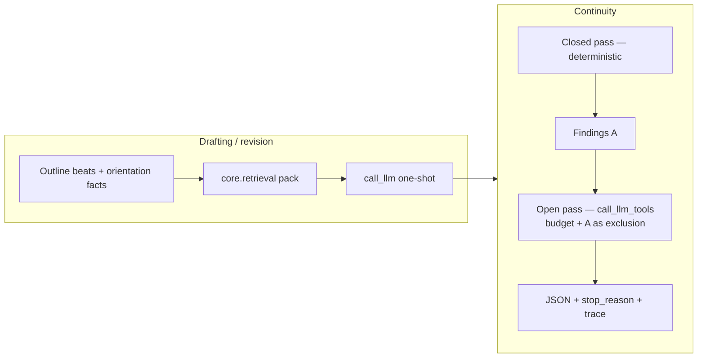

# Agentic Upgrades — Product Plan

Design record for turning the generative/verificational conversation into
shippable pipeline product. Implementation follows `gesaku-style` and
`gesaku-docs`. This doc is the plan of record until each phase lands; after
merge, behavior lives in the modules named here and this file moves to
`Docs/reference/archive/`.

---

## Product thesis

The pipeline already runs a Python workflow agent (phases, git, retries,
slop). The model itself is single-shot: stuff context, expect clean output.
That is correct for **generative** long-form drafting and wrong for
**verificational** continuity work.

Ship two increments, in order:

1. **Host-scoped retrieval** feeding one-shot draft/revision prompts
   (Python-owned, deterministic, pure upside).
2. **Bounded continuity judge** with a closed deterministic pass plus a
   capped tool-using open pass (the missing author-continuity capability).

Do **not** turn the writer into a free agent. Do **not** vendor OpenCode or
any CLI agent framework.

## Process (non-negotiable)

| Rule | Detail |
|---|---|
| **One branch, phase = one push** | No PR sequence theater. Implement a phase on the working branch, commit (messier commits OK), push when the phase is coherent enough to revert to. |
| **Harsh subagent review every phase** | After each phase's code+tests+docs are written, spawn a fresh `general` subagent as an adversarial reviewer before that phase is marked done. Non-negotiable — we will miss things. Review findings must be fixed or explicitly deferred in the plan before the push. |
| Skills | `gesaku-style` + `gesaku-docs` bind every change. |
| Offline gates | `uv run python -m unittest ...` for touched suites before push. |

## Locked design principles

| # | Principle | Product consequence |
|---|---|---|
| 1 | Generative vs verificational | Writer stays one-shot; continuity may use tools |
| 2 | Distraction budget | No mid-draft tool calls — they cost voice/flow, not just tokens |
| 3 | Closed evidence set → host scopes it | Outline/canon/world retrieval done in Python before the call |
| 4 | Open evidence set + lookup *is* the task → agent | Continuity open-pass only |
| 5 | Agentic value = judgment **stopping policy** | Budget + explicit `stop_reason`; never free-running |
| 6 | Mechanical checks stay in Python | Slop / seal denylist / entity lists — no LLM agent |
| 7 | Exclusion, not cold-start | Closed findings A block open-pass re-derivation **by prompt + post-hoc overlap metric** (prompt alone is not a constraint) |
| 8 | Auditability | Every open-pass flag traces to tool calls + stop condition |
| 9 | Reproducibility floor | Closed pass is deterministic; open pass is capped and logged |
| 10 | One owner per fact | Chapter count, budgets, paths keep existing owners |
| 11 | Unequal closed checks | Not all Findings A kinds are equally trustworthy; name the weak ones |



---

## Phase 0 — Plan on the shelf (no behavior change)

**Goal:** durable plan + process rules on the working branch.

| Action | File |
|---|---|
| This plan | `Docs/reference/agentic-upgrades.md` |
| Index entry | `Docs/overview.md` Documentation Map |
| Process rules | Project memory + this doc's Process section |

**Exit:** plan updated with review/budget/exclusion/hedge decisions; then implement.

---

## Phase 1 — Outline-driven retrieval (ship first)

**Goal:** stop dumping full `world.md` + `characters.md` into every
draft/revision prompt. Inject a beat-scoped pack instead.

### Why here

Same pattern the repo already owns: `canon.writer_view_md` (chapter-scoped),
`visible_from` sealing, crutch-phrase bans. Python decides what the writer
may see; generation stays one-shot and git-reproducible.

### New module

`core/retrieval.py` — shared library only. Must not import `pipeline/`.

```text
RetrievalPack
├── characters_block   # registry entries hit by this chapter's outline
├── world_block        # world sections hit by beat/location keywords
├── canon_view         # passthrough only; draft still renders writer_view_md
├── open_debts         # DEFERRED — still assembled in draft_chapter guardrails
├── not_established    # DEFERRED — sealed denylist stays at draft call site
├── query_terms        # what retrieval actually used (telemetry)
└── mode               # "scoped" | "dump"
```

Deferred pack fields are intentional (harsh review 2026): sealed text is never
owned by retrieval; debts remain draft-chapter guardrails.

### Deterministic query construction (no LLM)

1. Chapter outline entry (existing `draft_chapter.extract_chapter_outline`).
2. Orientation facts (`parse_orientation_facts`).
3. Premise beats when `chapter_num == 1`.
4. Capitalized multi-word tokens + known character-section headings.
5. Location/world headings that appear in the outline text.
6. Prior-chapter crutch scan stays as-is (already deterministic).

Hits select **sections** from `characters.md` / `world.md` (heading-scoped
slices), not free paraphrase.

### Call sites to change

| File | Change |
|---|---|
| `pipeline/draft_chapter.py` | Replace full world/characters dump with `RetrievalPack` blocks |
| `pipeline/gen_revision.py` | Same pack for revision prompts |
| Optional later | `pipeline/eval_prompts.py` chapter judge may keep fuller context initially |

### Config (named budgets pattern)

| Env | Values | Default |
|---|---|---|
| `GESAKU_RETRIEVAL_MODE` | `dump` \| `scoped` | `dump` until Phase 6 validates; flip to `scoped` after A/B |

`dump` = today's behavior (full bibles). `scoped` = pack. Never invent
per-call-site flags.

### Prompt material

Any new static instruction text → `prompts/*.md` via `paths.load_prompt`.
Keep `{placeholder}` conventions (`Docs/core/prompt-management.md`).

### Telemetry

Append retrieval stats to the chapter's eval sidecar or a small
`projects/<name>/eval_logs/retrieval_chNN_telemetry.json` (renamed at ship time — see Deferred):

`{mode, query_terms, character_hits, world_hits, prompt_chars_before, prompt_chars_after}`

`llm_events.jsonl` already records `prompt_chars` — use it for size deltas.

### Tests (offline)

`tests/test_retrieval.py`:

- entity/term extraction from a fixture outline
- section hit selection
- sealed terms never appear in writer-facing pack
- `mode=dump` still returns full texts
- no `pipeline` import from `core.retrieval`

### Docs

| Doc | Update |
|---|---|
| `Docs/core/context-retrieval.md` | **new** — pack shape, modes, owners |
| `Docs/overview.md` | module map + doc index |
| `AGENTS.md` | `GESAKU_RETRIEVAL_MODE` when implemented (volatile) |

### Exit criteria

- Offline suite green
- Sealed facts still excluded from writer prompts
- Measurable `prompt_chars` drop under `scoped` on a real project
- Chapter scores not worse on A/B (one project, same seed notes)

---

## Phase 2 — Tool-call substrate (`call_llm_tools`)

**Goal:** multi-turn tool loop on top of the existing client. No framework
vendoring.

### Scope

Extend `core/llm.py` only. Patterns may be *inspired* by Anthropic tool-use
docs / coding-agent loops; code is ours.

```text
call_llm_tools(
    messages, tools, executor,
    *, model_key="judge", budget=None,
    max_tokens=..., temperature=0.2,
    beta_context=True, timeout_role="xlong",
) -> ToolLoopResult
```

`ToolLoopResult`:

```text
text                 # final assistant text (verdict JSON)
stop_reason          # end_turn | max_tokens | budget_exhausted | error
agent_stop           # leads_exhausted | budget_exhausted | end_turn | error
tool_calls_used
budget
trace[]              # {ts, tool, input, output_chars, ok, error?}
model, provider, tokens_in/out (sum)
```

### Loop rules

1. POST with `tools` in the provider dialect (Anthropic `tools` /
   OpenAI `tools`).
2. If response contains tool calls → `executor(name, input_dict)` → append
   tool results → continue.
3. Stop when:
   - assistant returns text with no tool calls → `agent_stop=leads_exhausted`
     when the model also returns an explicit “no further leads” signal in the
     verdict schema; otherwise `end_turn`
   - `tool_calls_used >= budget` → `agent_stop=budget_exhausted`
   - `stop_reason == max_tokens` → truncation handling as today
   - executor/HTTP hard failure → `error`
4. **Log which stop fired** — never conflate budget vs leads in the trace.
5. Retries follow `call_llm` backoff for transport errors only; do not
   silently reset the tool budget.

### Executor contract

Python-owned, read-only. The Phase 4 judge supplies the executor; the LLM
module stays generic.

### Budget owner

`pipeline.pipeline_infra.judge_tool_budget()` → `GESAKU_JUDGE_TOOL_BUDGET`.

**Committed default: 12.** Not a placeholder — Phase 2 ships with
`JUDGE_TOOL_BUDGET = 12` in the named table. Rationale: enough for ~4
searches + ~5 reads + ~3 follow-ups on a 3k-word chapter, tight enough that
`budget_exhausted` is a real early signal. Phase 6 may retune via env; the
named-table default is 12 until that campaign changes it in one place.

### Preflight (gateway risk)

Local proxy (`ANTHROPIC_BASE_URL`) may strip tools. Extend
`pipeline/preflight.py`:

- one trivial tool call (`echo` / `noop`) before any judge pass
- fail fast with an actionable message if tool blocks are missing/flattened

### MockLLM

Extend `core/mock_llm.MockLLM` to:

- return scripted tool-use turns
- honor budget stop
- allow offline tests for the full loop

### Tests

`tests/test_llm_tools.py`:

- anthropic + openai payload shape (tools present, messages accumulate)
- budget stop sets `agent_stop=budget_exhausted`
- natural end sets `leads_exhausted` / `end_turn` correctly
- trace records every tool call
- MockLLM rebinding still works
- transport retry does not double-spend budget

### Docs

`Docs/core/llm-client.md` — new Tools section: result shape, budget env,
preflight, dialect table row.

### Exit criteria

- Offline tool-loop tests green
- Preflight detects a tools-stripping gateway in a simulated mock
- No new runtime dependency

---

## Phase 3 — Closed-pass continuity (Findings A)

**Goal:** deterministic contradictions/seal-leaks *before* any agent spend.

### New stage scripts

| File | Layer |
|---|---|
| `core/continuity_text.py` | pure text helpers (entity lists, section compare) |
| `pipeline/continuity_closed.py` | project I/O + Findings A writer |

`foundation/` must not import these if they pull pipeline pieces — keep
text helpers in `core/`.

### Closed checks (no LLM) — trust is unequal

| Check | Failure direction | Trust |
|---|---|---|
| **Seal leaks** | High precision intended; leak is structural risk | High — treat seriously |
| **unknown_entity** | **Noisy by design** — fires on one-off places, capitalized metaphors, dialogue tags, minor NPCs | **Low.** False positives expected and OK. Warn-only. Do **not** treat a high count as “continuity is broken”; treat it as a fuzzy recall list for the open pass / human skim |
| **Location mismatches** | Medium noise (generic place words) | Medium-low |
| **Canon contradictions** | Rule-based, **conservative; false negatives OK** | Medium — misses are OK, hits worth a look |
| **Plant/harvest hygiene** | Uses existing `core.outline` owners | High for tag format; low for story quality |

Doc must not present these five as equally reliable. Future readers: `unknown_entity` is a **recall-oriented** signal feeding a warn-only gate, not a precision instrument.

### Findings A shape

```json
{
  "id": "A3",
  "kind": "seal_leak | unknown_entity | location | canon | plant",
  "claim": "Chapter uses 'Resonance' meaning sealed Law III fact",
  "chapters": [3, 12],
  "evidence": ["excerpt", "canon bullet"],
  "severity": "warn | structural",
  "trust": "high | medium | low"
}
```

### Output

`projects/<name>/eval_logs/continuity_chNN_closed.json` via atomic write.

### Gate policy (invariant)

Quality findings **warn**. Do not turn critic failures into drafting aborts.

**`severity: structural` is reserved and unused by gates today.** It exists
for a possible future seal-leak escalation path; nothing in the pipeline
branches on it yet. Do not grep for a consumer and assume an oversight —
the consumer was deferred on purpose. Until a gate change lands, every
finding behaves as `warn`.

### Tests

`tests/test_continuity_closed.py` — fixtures with planted seal leak,
unknown entity, clean chapter; assert `trust` metadata present.

### Exit criteria

- Closed pass runs offline on fixtures
- Deterministic: same inputs → same Findings A
- `trust` field set per check kind
- Wired optionally behind `on_chapter_kept` or a CLI `--continuity-closed`

---

## Phase 4 — Open-pass continuity judge (bounded agent)

**Goal:** unknown-unknowns the closed pass cannot enumerate, on a leash.

### New pieces

| File | Role |
|---|---|
| `pipeline/continuity_open.py` | stage: tools + loop + verdict write |
| `prompts/continuity_system.md` | system prompt (exclusion rules, stop signal) |
| `prompts/continuity_verdict.md` | user template + Findings A block |
| `core/validation.py` | `ContinuityVerdict` Pydantic model |

### Tools (read-only, project files only)

| Tool | Behavior |
|---|---|
| `search_canon` | query `canon.md` under writer/author scope |
| `read_chapter` | `ch_NN.md` full or span |
| `search_prior_chapters` | grep chapters 1..N-1 |
| `read_outline_chapter` | outline entry for a chapter |
| `search_characters` | registry section/name hits |
| `search_world` | world bible section hits |

No bash, no writes, no web.

### Author scope (sealed access)

Open pass may see **author** canon (including sealed) to catch mask/twist
coherence — the gap AGENTS.md already names (`judge_view == writer_view`).
Rules:

- Findings that depend on sealed facts are tagged `author_only: true`
- **Never** write sealed text into draft/revision prompts
- Closed-pass seal *leaks in prose* remain author-side findings, not writer fuel

### Exclusion (Findings A → open pass)

Prompt-level exclusion is **not enforced**. Compliance is not a constraint.

1. **Prompt (necessary, insufficient):** pass A as `{id, claim, chapters}`;
   instruct the model not to re-derive these claims; investigate **new**
   contradictions, including new angles on the same entities. Exclusion ≠
   “ignore these names.”
2. **Executor budget is still spent** if the model disobeys — the real
   failure mode is tool calls burned re-investigating A, not merely
   re-emitting A in the verdict.
3. **Post-hoc overlap metric (required):** after the loop, compute
   `overlap_a_tool_targets` — fraction of open-pass tool calls whose
   inputs touch A's claim set (entities / chapter ids / distinctive claim
   tokens). Write it into the continuity JSON and the trace summary.
   Non-blocking. Correlate with `agent_stop=budget_exhausted` in the
   stability probe: high overlap + budget_exhausted → model was re-deriving
   A (tighten exclusion prompt or filter A out of searchable surfaces);
   low overlap + budget_exhausted → budget genuinely too tight for
   unknown-unknowns.
4. **Tests must not pretend prompt compliance is enough.** A scripted
   “well-behaved model doesn't re-emit A” test is necessary but weak.
   Also test: overlap metric computed correctly when trace tools touch A
   chapters/entities; overlap reported even when verdict findings B are
   clean.

### Verdict schema (`ContinuityVerdict`)

```text
findings[]: {id, kind, claim, chapters[], evidence[], severity, author_only}
leads_exhausted: bool          # model judgment signal
notes: str
# host appends: stop_reason, agent_stop, tool_calls_used, budget, trace, model
```

Parse with `validation.parse_validated(..., model=ContinuityVerdict)`.
Schema failures join the existing self-correction retry pattern.

### Stop-condition logging (required)

Merged output always includes:

| Field | Why |
|---|---|
| `agent_stop` | `budget_exhausted` vs `leads_exhausted` diagnosis |
| `tool_calls_used` / `budget` | headroom signal |
| `trace[]` | audit: what it looked up, not just what it concluded |
| `overlap_a_tool_targets` | post-hoc A↔tool-call overlap (exclusion effectiveness; non-blocking) |

**Stability probe:** optional re-run (`--stability`) on the same chapter;
log finding-id overlap. Stratify variance by `agent_stop` **and** `overlap_a_tool_targets`:

| Dominant stop | High variance | Low variance |
|---|---|---|
| `budget_exhausted` + high A-overlap | re-deriving A — fix exclusion/filter, not just budget | budget OK, probe noise |
| `budget_exhausted` + low A-overlap | budget too tight for unknown-unknowns — raise it | sparse chapter, OK |
| `leads_exhausted` | prompt / confidence threshold | designed behavior |

### Hook

- Phase 4a: CLI `pipeline/continuity_open.py <ch>` after a kept chapter
  (fail-soft, like micro-plants) — `pipeline/phases/common.on_chapter_kept`
- Phase 4b (optional): export-time or review_loop pass over all chapters

Default gate: **warn** into logs / eval sidecar; do not block keep.

### Output

`projects/<name>/eval_logs/continuity_chNN.json` (atomic):

`findings_a, findings_b, merged, agent_stop, tool_calls_used, budget, trace, overlap_a_tool_targets, model, stability?`

### Tests

`tests/test_continuity_open.py` (MockLLM tool loop):

- exclusion instruction present; A not re-returned as B (scripted — necessary, weak)
- **overlap metric**: trace tools touching A's chapters/entities → `overlap_a_tool_targets > 0` even when findings B empty
- **overlap metric**: tools only on novel targets → overlap ~0
- budget stop recorded with correct `agent_stop`
- `author_only` tagging on sealed-derived finding
- executor denies path escape outside project
- offline, no network

### Docs

| Doc | Update |
|---|---|
| `Docs/pipeline/continuity-judge.md` | **new** — closed+open, gates, schema, env, trust table |
| `Docs/core/output-validation.md` | `ContinuityVerdict` row |
| `Docs/overview.md` | pipeline map + doc index |
| `Docs/reference/test-suites.md` | new suites |
| `AGENTS.md` | judge budget env, still-missing note update |

### Exit criteria

- Offline suite green
- Real-proxy preflight passes tool path
- Trace + `agent_stop` + `overlap_a_tool_targets` present on every open-pass result
- Writer prompts unchanged by sealed author findings
- **Harsh subagent review completed; findings fixed or deferred in this doc**

---

## Phase 5 — Operator surface

| Item | Detail |
|---|---|
| Webui Settings | expose `GESAKU_RETRIEVAL_MODE`, `GESAKU_JUDGE_TOOL_BUDGET` in the same `.env` pattern as existing gates |
| Webui later | continuity findings list on project dashboard (non-blocking) |
| `Docs/systems/console-bridge.md` | update when routes change |
| `AGENTS.md` | monitoring bullets for continuity logs + stop histograms |

Not required to declare Phase 1–4 done; required before calling the feature
operator-complete. Same harsh-review rule before push.

---

## Phase 6 — Validation campaign (product exit)

On a real project (new run or controlled resume):

1. `GESAKU_RETRIEVAL_MODE=dump` baseline chapter scores + `prompt_chars`.
2. Flip `scoped`; compare scores, prompt size, continuity false-positive rate.
3. Run closed pass on all chapters; sample open pass on 3–5 chapters.
4. Stability probe: re-run open pass; read `agent_stop` × `overlap_a_tool_targets`; tune budget in the named table only if needed.
5. Only then default retrieval to `scoped` in docs / recommended `.env`.
6. Note in `AGENTS.md`: scores across this change are **not** comparable to
   pre-change runs (same rule as the revision-step path fix).

**Product done when:** scoped retrieval is the recommended default, continuity
judge emits auditable JSON with stop reason + overlap metric, offline gates stay green, and
one full run ships without seal leaks into writer prompts.

---

## Explicit non-goals

- Mid-draft tool-calling writer (distraction budget; no verifiable intermediate state)
- Vendoring OpenCode / DeepSeek harness / any agent CLI as a runtime
- Free-running unbounded continuity agent
- Replacing mechanical slop with an LLM agent
- Editing `fuel/` as documentation
- Silent score fallbacks on schema failure
- `foundation/` importing `pipeline/`
- Multi-PR ceremony for this upgrade (one branch, phase = push)

## Peek vs build (decision record)

| Peek (patterns) | Build (product) |
|---|---|
| Anthropic/OpenAI tool-use wire shape | `core/llm.call_llm_tools` |
| Tool description quality from production CLIs | our read-only tool schemas |
| SWE-harness trajectory logging | our `trace[]` + `agent_stop` + overlap |
| Step-budget / max-turns conventions | `GESAKU_JUDGE_TOOL_BUDGET=12` |

No framework dependency for a ~200-line loop that must obey resume, named
budgets, and git-shaped state.

---

## File manifest

### New

- `core/retrieval.py`
- `core/continuity_text.py`
- `pipeline/continuity_closed.py`
- `pipeline/continuity_open.py`
- `prompts/continuity_system.md`
- `prompts/continuity_verdict.md`
- `Docs/core/context-retrieval.md`
- `Docs/pipeline/continuity-judge.md`
- `tests/test_retrieval.py`
- `tests/test_llm_tools.py`
- `tests/test_continuity_closed.py`
- `tests/test_continuity_open.py`

### Modified

- `core/llm.py` — `call_llm_tools`, `ToolLoopResult`
- `core/mock_llm.py` — tool-loop support
- `core/validation.py` — `ContinuityVerdict`
- `core/paths.py` — continuity/retrieval log helpers if missing
- `pipeline/draft_chapter.py` — scoped pack
- `pipeline/gen_revision.py` — scoped pack
- `pipeline/pipeline_infra.py` — `judge_tool_budget()`
- `pipeline/preflight.py` — tool-path probe
- `pipeline/phases/common.py` — optional `on_chapter_kept` continuity hook
- `Docs/overview.md`, `Docs/core/llm-client.md`,
  `Docs/core/output-validation.md`, `Docs/reference/test-suites.md`
- `webui/routes/settings.py` (+ frontend settings) when Phase 5 lands
- `AGENTS.md` — env + monitoring (volatile)

---

## Delivery process (replaces multi-PR sequence)

**One branch. Phase = one push.** Messier commits are fine; each push must
be revertible to “before this phase.”

| Push | Contents |
|---|---|
| Push 0 | Plan doc + overview index + process rules |
| Push 1 | Phase 1 retrieval + wiring + tests + `Docs/core/context-retrieval.md` |
| Push 2 | Phase 2 `call_llm_tools` + MockLLM + preflight + llm-client doc |
| Push 3 | Phase 3 closed continuity + tests + `on_chapter_kept` hook |
| Push 4 | Phase 4 open judge + prompts + schema + continuity doc |
| Push 5 | Phase 5 webui settings + console-bridge doc |
| Push 6 | Phase 6 campaign notes + default flip + AGENTS.md |

**Before every push:** offline tests green **and** a harsh `general`
subagent review of the phase diff. Fix or defer findings in this doc.

### Review log

| Phase | Reviewer | Outcome |
|---|---|---|
| 1 retrieval | general-1 | **Fixed.** Parent/child markdown sections; sealed-pack + fallback tests; telemetry WARN; `extract_chapter_outline` → `core/outline.py`; AGENTS/test-suites/docs. Deferred: pack `not_established` / `open_debts` / premise-beat injection (documented). |
| 2 tools | general-3 | **Fixed.** SSE-aware tool parse (`_parse_tool_turn_from_response`); unparseable/stripped → `agent_stop=error` (never silent `end_turn`); budget stop harvests final tool-free verdict POST; `GESAKU_REQUIRE_TOOLS` fatal on probe exception + case-insensitive; MockTransport tests (payload accumulate, SSE, stripped, harvest, retry budget, preflight); restored `call_llm` after a splice regression. |
| 3 closed | general-4 | **Fixed.** Seal leaks follow plant_hygiene (no always-on frame noise; empty sealed → no findings); negation regex real `{{0,80}}` gap; Plant+Harvest prose tags; location trust `low`; overlap metric structured (chapter equality + distinctive tokens, not JSON substring); unused imports dropped. |
| 4 open | general-5 | **Fixed.** Models → `core/validation.py`; path guard; non-dict JSON; error sidecars; author_only seals; open-pass CLI-only until Phase 6. |
| 5 webui | general-6 | **Fixed.** Duplicate Settings.jsx `agentic` key; budget clamp 0–200 on GET/POST/`judge_tool_budget()`; non-numeric budget → 400; unique `.env` tmp; console-bridge.md agentic rows; more boundary tests. |
| 6 run | general-7 | **Partial / honest.** Proxy **is up** (docs were wrong — fixed in AGENTS). Open-pass smoke is MockLLM — **not** live validation. Entity regex `\s+` newline bug + stopwords fixed; evidence[] via `make_finding`. Telemetry `prompt_chars_*` = null until draft-time join; plan schema amended. Recommended default stays `dump`; `.env` `scoped` is verification override only. Live open-pass still unvalidated. |
| 7 defects | four parallel general reviewers (llm / retrieval+continuity / wiring+webui / doc-drift) | **Fixed.** Streamed tool arguments were silently lost (Anthropic `input_json_delta` ignored; OpenAI fragments not merged by index) — both now accumulate. Harvest no longer appends a consecutive `user` turn. Retrieval telemetry renamed `retrieval_chNN_telemetry.json` (a bare `retrieval_chNN.json` shadowed `*_chNN.json` eval-score lookups). `core/retrieval.py` regex newline bug + name-dropping denylist fixed. Tool loop moved out of `core/llm.py`. Overlap denominator counts real tool calls; plant-tag scan uses the tag-format owner; error sidecar key set matches the success path; harvest emits telemetry and `prompt_chars`; preflight omits empty key headers; counts/docs corrected. |
| 7b verification | two fresh general reviewers on the fix diff | **Fixed.** The fix introduced a circular import (tool modules imported back into `llm.py`): the client base now lives in `core/llm_base.py`; `llm.py` is 175 lines and every import order works. Multi-tool stream tests added — no test could previously catch two tool calls merging, and the no-`index` fallback did merge them. `continuity_open` sidecar renamed `_open.json` (it shadowed eval lookups the same way); `paths.retire_shadowing_sidecar` deletes the pre-rename file on the next write for both producers. Plant tags whose slug contains an apostrophe/dot are scanned again (84/84 on the real outline). Retrieval now filters multi-word schema labels instead of real names. `sealed_terms_loaded` vs `sealed_terms_checked` reported separately; fractional tool budget → 400; retry policy named once in `llm_base`. |
| 7c re-verification | fresh general reviewer | **Holds (one gap fixed).** Import orders, two-tool separation, index-less fallbacks, tag recall, sidecar names, loaded/checked split, fractional budget, named retries, full gates: all verified. Gap: the pre-existing `continuity_chNN.json` artifact still shadowed `_latest_chapter_score` on the smoke project — `retire_shadowing_sidecar` now covers it (tested for both renames). |
| 8 live run (v5, 24ch) | real writer_combo run + wire probes | **Fixed.** A 200 whose body never opened a text block (combo upstream streaming thinking only) was recorded as a *successful empty generation*; the empty string then failed the caller's validation and killed the step (`gen_genre_framework`, then `gen_characters`). `call_llm` now raises `EmptyResponseError` for a 200 with no text and no stop_reason and retries it like a transport fault (`LLM_MAX_TRANSPORT_ATTEMPTS`); `max_tokens` keeps its `TruncationError` path. Upstream cause was `ling-3.0-flash-fin-free` in the pool (removed by the operator). Also learned: this proxy runs 50-500s per large generation, so `GESAKU_TIMEOUT_STANDARD=3600` / `GESAKU_TIMEOUT_LONG=7200` are required for a full run. |

**Deferred:**
- Phase 4a automatic open-pass on keep — **still CLI-only**; live open-pass not validated (tool/model path flaky).
- Pack fields `not_established` / `open_debts` — sealed/debt ownership stays at draft call site.
- Judge JSON self-correction retry on open-pass schema failure — warn-only empty B for now.
- Push 6 “default flip” — **not done**; keep recommended `dump` until live A/B.
- Shipped JSON key is `wire_stop_reason` (plan host field name: `stop_reason`).
- Retrieval telemetry sidecar is `retrieval_chNN_telemetry.json` (the plan's bare
  `retrieval_chNN.json` collided with the `*_chNN.json` eval-score glob).
- Tool loop ships in `core/llm_tools.py` (loop) + `core/llm_toolwire.py` (wire),
  over a shared `core/llm_base.py` client layer; `core/llm.py` (175 lines)
  re-imports them. The plan's `core/paths.py` change was not needed.
- Frontend mirrors the default tool budget (`?? 12`) instead of reading it from the
  backend; the clamp range 0–200 is still declared in more than one place.

**Shipped telemetry schema (authoritative):**
`RetrievalPack.to_telemetry()` → mode, query_terms, character_hits, world_hits,
character_fallback, world_fallback, characters_chars, world_chars,
prompt_chars_before/after (null until draft call site joins llm_events).
Host continuity JSON → wire_stop_reason, agent_stop, tool_calls_used, budget,
trace, overlap_a_tool_targets.

No foundation→pipeline imports. Named budgets only. Hosts must pass `judge_tool_budget()` into `call_llm_tools`.

---

## Risk register

| Risk | Mitigation |
|---|---|
| Proxy strips tool calls | Phase 2 preflight; fail fast |
| Scoped retrieval under-finds | `dump` mode fallback; seal layer still structural |
| Open-pass nondeterminism | budget=12, `agent_stop`, `overlap_a_tool_targets`, stability probe, full trace |
| Sealed facts leak into drafts | `author_only` tags; writer path never reads open-pass findings |
| Score non-comparability across the change | AGENTS.md warning, same as revision-path fix |
| Judge gate becomes fatal | quality warns only; structural aborts stay rare and explicit |
| Module monoliths past ~500 lines | split by concern as files grow (gesaku-style) |
